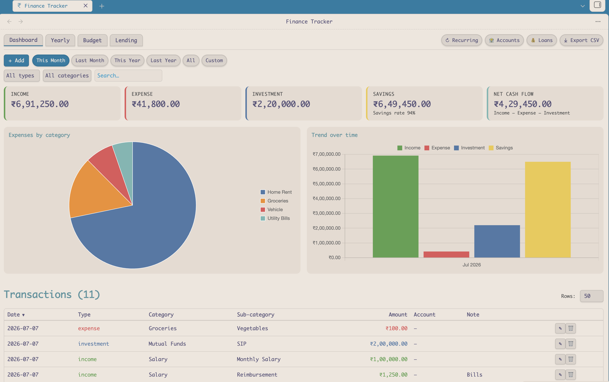
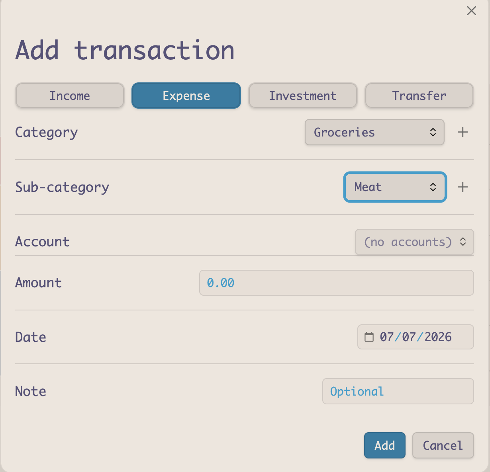

# Finance Tracker

A personal finance plugin for [Obsidian](https://obsidian.md) — track income, expenses, investments, savings, lending, and multiple accounts, with a one-click entry flow and a visual dashboard. All data stays in your vault as a plain JSON file.

## Screenshots

### Dashboard


### One-click transaction entry


## Features

- **One-click entry** — a ribbon icon / command opens a quick modal: pick a type, category, sub-category, amount, date, and account. Add new categories and sub-categories on the fly.
- **Dashboard** with a date-range control (This Month / Last Month / This Year / Last Year / All / Custom), summary cards, and charts.
- **Charts** — expense breakdown pie chart and a monthly Income / Expense / Investment / Savings bar chart (via Chart.js).
- **Correct savings model** — Savings = Income − Expense; a separate **Net cash flow** card (Income − Expense − Investment, including lending activity).
- **Multiple accounts** — cash, bank accounts, wallets with initial balances. Transfer between accounts. Per-account balances plus an aggregate total and **net worth**.
- **Lending & borrowing** — track money lent out or borrowed with counterparty, interest rate, and due date. Record repayments (principal + interest). Excluded from expenses/investments; reflected in net cash flow and net worth. Due-date reminders.
- **Budgets** — set a monthly budget per expense category and see budget-vs-actual progress bars.
- **Recurring transactions** — auto-post rent, SIPs, salary, etc. on a weekly/monthly/yearly schedule.
- **Yearly summary** — per-year totals and a monthly breakdown.
- **CSV export** of transactions.
- **Paginated, sortable transactions table** with sticky headers.
- **Mobile-friendly** (works on Obsidian for Android/iOS).

## Data storage

Transactions and loans are stored in a single JSON file in your vault (default: `_finance/finance-data.json`). Categories, accounts, budgets, and recurring rules are stored in the plugin's settings. You can change the data file path in settings.

## Installation

### Via BRAT (beta)

1. Install the [BRAT](https://github.com/TfTHacker/obsidian42-brat) community plugin.
2. In BRAT settings, choose **Add beta plugin** and enter this repository's URL.
3. Enable **Finance Tracker** under Settings → Community plugins.

### Manual

1. Download `main.js`, `manifest.json`, and `styles.css` from the latest [release](../../releases).
2. Copy them into your vault at `.obsidian/plugins/finance-tracker/`.
3. Reload Obsidian and enable **Finance Tracker** under Settings → Community plugins.

## Development

```bash
npm install      # install dependencies
npm run dev      # watch build
npm run build    # type-check + production build (outputs main.js)
```

Releases are produced automatically by GitHub Actions when a version tag (e.g. `1.0.0`) is pushed.

## License

[MIT](LICENSE)
